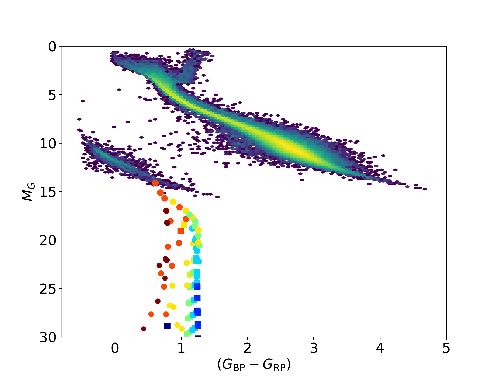

# Research Interests

Previously, at the University of Toronto my worked revolved around atomic dark matter, and how stars made of this matter could be detected. These stars, known as mirror stars, can gravitational capture ordinary matter and superheat them to detectable ranges. My work focused on the theoretical modelling of these stars, followed by a numerical simulation of their signatures. For this analysis, I used the Digital Research Alliance of Canada's Niagara Supercomputer located at the University of Toronto.

My current work is in topological defects in cosmology, specifically the signatures of domain walls created during phase transitions in the early universe.

## Recent Highlights
 - ["Electromagnetic Signatures of Mirror Stars" Berkin Gurbuz, et al., 2024](https://iopscience.iop.org/article/10.3847/1538-4357/ad283c)

Here is a figure from the paper!

{align="left": style="height:400;width:400px"}

It is the Hertzsprug-Russel (HR) Diagram with my mirror stars included! We see that mirror stars look like very dim white dwarfs in the night sky, but we develope techniques to distinguish them from other stars so that astronomers may look for them!

A full list of my publications can be found [here](https://inspirehep.net/authors/2728732).